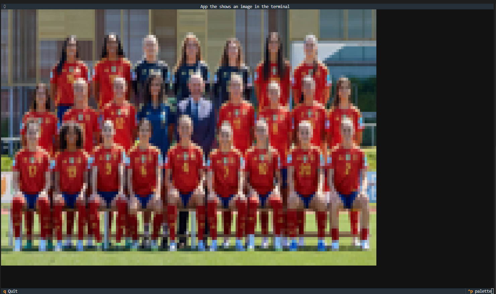

# Textual Laboratory

Playing with textual to create new widgets.

For example, a widget to visualize images




## Setup

Create a virtual environment
```bash
python -m venv venv
```

Activate the enviroment
```bash
venv\Scripts\activate
```

Install all the dependencies
```bash
pip install -r requirements.txt
```

## Usage


* The app will run as a terminal user interface app.
```bash
python "app.py"
```


## Libraries 
- https://pypi.org/project/textual-autocomplete/
- https://pypi.org/project/textual-plotext/
- https://pypi.org/project/textual-canvas/
- https://pypi.org/project/plotext/
- https://pypi.org/project/rich-pixels/
- https://pypi.org/project/textual-image/
- https://github.com/adamviola/textual-imageview  
